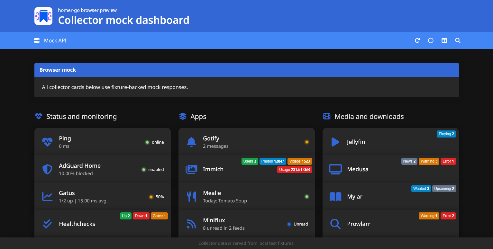
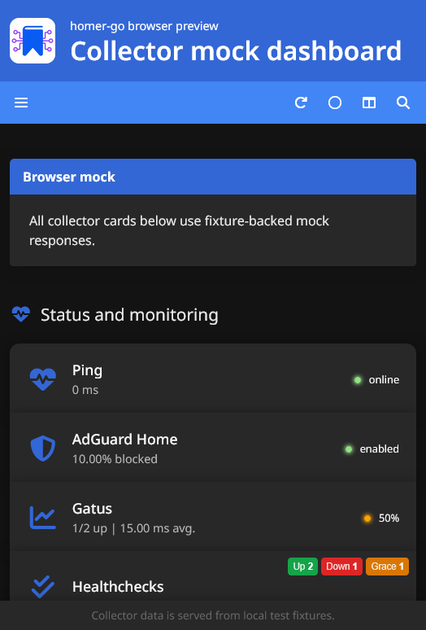

# homer-go

[English](../../README.md)

homer-go 是一个轻量级、自托管的首页仪表盘，基本兼容 [Homer](https://github.com/bastienwirtz/homer) 的 `config.yml` 配置文件。它能将您的常用链接、服务状态、快捷操作等整合在单个浏览器页面中，并以单个 Go 服务运行。

本项目为追求「Homer 般的使用体验，但希望以单一 Go 服务运行」的用户设计，并为支持的智能卡片提供服务端状态收集功能。得益于**服务端渲染 (SSR)**，仪表盘加载速度极快，无需等待客户端脚本执行。



<details>
<summary>手机端截图</summary>



</details>

## 与 Homer 的主要区别

homer-go 兼容大部分 Homer 的 YAML 配置格式，因此现有 Homer 用户通常可以从当前 `config.yml` 开始迁移。主要区别如下：

- **配置加载**：homer-go 从数据目录读取配置，通常是当前工作目录下的 `config.yml`，Docker 中则是 `/data/config.yml`；Homer 通常使用 `assets/config.yml`。
- **路径行为**：与 Homer 不同，`http://` 和 `https://` 仍然表示远程 URL；但 `icons/app.png`、`custom.css` 这类裸相对路径会按数据目录中的文件解析，而不是相对于浏览器 URL。
- **状态收集**：智能卡片数据由 homer-go 服务端收集。这通常能避免影响 Homer 智能卡片的浏览器 CORS 问题。
- **静态资源**：应用自带嵌入式静态资源。
- **搜索功能**：采用基于表单的搜索，而非 Homer 的模糊键盘搜索。目前尚未实现 Homer 的 `/`、`Escape` 和 `Enter` 搜索快捷键。
- **暂不支持的配置**：部分 Homer 配置项目前会被忽略，包括 `hotkey`、`proxy.useCredentials`、单项 `useCredentials` 以及单项刷新间隔配置。
- **卡片支持**：homer-go 尚未实现 Homer 的所有智能卡片类型。不支持的服务类型仍会渲染为普通链接，但不会显示实时状态。

## 功能特性

- 基于 YAML 的仪表盘配置
- 支持分组、服务卡片、标签、图标、Logo、快速链接
- 内置浅色、深色及跟随系统的自动主题切换
- 提供列布局和列表布局偏好设置
- 支持按名称、副标题、标签和关键字搜索
- 支持通过 `page-name.yml` 实现多页面
- 可选的远程消息横幅
- 支持 PWA
- 支持反向代理基路径，例如 `/dashboard`
- 为支持的集成服务提供服务端状态收集

## 快速开始

在空目录中运行二进制文件：

```sh
homer-go
```

访问 `http://localhost:8732`。

如果 `config.yml` 不存在，homer-go 会自动创建一个示例文件。编辑该文件并刷新页面即可看到效果。

常用启动参数：

```sh
homer-go -addr :8732 -data /path/to/config -base-path /homer-go
```

也支持环境变量：

- `HOMER_GO_ADDR`：监听地址，默认 `:8732`
- `HOMER_GO_DATA_DIR`：数据目录，默认 `.`
- `HOMER_GO_ASSETS_DIR`：资源目录，默认 `assets`
- `HOMER_GO_BASE_PATH`：基路径，默认空

## Docker 部署

```sh
docker run -d \
  --name homer-go \
  -p 8732:8732 \
  -v /path/to/homer-go-data:/data \
  --restart unless-stopped \
  ghcr.io/outlook84/homer-go:latest
```

容器会将 `config.yml` 存储在 `/data` 中。如果挂载目录为空且具有写权限，homer-go 会在首次启动时写入示例配置。

## 配置示例

一个精简的配置示例如下：

```yaml
title: "Home"
subtitle: "Dashboard"
logo: "/assets/icons/homer-go-logo-v2.png"
header: true
columns: "3"
defaults:
  layout: columns
  colorTheme: auto

links:
  - name: "GitHub"
    icon: "fab fa-github"
    url: "https://github.com/outlook84/homer-go"
    target: "_blank"

services:
  - name: "Apps"
    icon: "fas fa-server"
    items:
      - name: "Home Assistant"
        type: "HomeAssistant"
        icon: "fas fa-house"
        url: "https://homeassistant.example.com"
        apikey: "your-token"
        tag: "home"
      - name: "Docs"
        icon: "fas fa-book"
        subtitle: "Local documentation"
        url: "https://docs.example.com"
        quick:
          - name: "Admin"
            icon: "fas fa-lock"
            url: "https://docs.example.com/admin"
```

如需增加页面，请在同一数据目录下创建 `media.yml` 或 `infra.yml` 等文件。在 `links` 中使用 `#media` 即可链接，或直接通过 `/?page=media` 访问。

本地图片和自定义样式表可以放在数据目录下，并使用裸相对路径引用。这些路径是数据目录下的文件路径，不是相对于当前浏览器 URL 的路径。`http://` 和 `https://` 会继续作为远程 URL 使用。内置资源可在 `/assets/` 下找到。

更多文档：

- [配置](./configuration.md)
- [智能卡片](./smart-cards.md)
- [主题](./theming.md)
- [技巧](./tips-and-tricks.md)
- [故障排查](./troubleshooting.md)
- [开发](./development.md)

## 支持的智能卡片

homer-go 目前支持为以下服务收集状态：

AdGuardHome, Docuseal, DockerSocketProxy, Emby, FreshRSS, Gatus, Gitea, Glances, Gotify, Healthchecks, HomeAssistant, HyperHDR, Immich, Jellyfin, Lidarr, Matrix, Mealie, Medusa, Miniflux, Mylar, NetAlertx, Nextcloud, Olivetin, OpenHAB, PaperlessNG, PeaNUT, PiAlert, Ping, Portainer, Prometheus, Proxmox, Prowlarr, qBittorrent, Radarr, Readarr, SABnzbd, Scrutiny, Sonarr, SpeedtestTracker, Tautulli, Tdarr, Traefik, TruenasScale, UptimeKuma, Vaultwarden, Wallabag, 和 WUD。

对比 Homer 源码，以下智能卡片目前在 homer-go 中尚未实现：CopyToClipboard, Jellystat, Linkding, OctoPrint/Moonraker, OpenWeather, PiHole, Plex, rTorrent, 和 Transmission。

## 安全提示

`config.yml` 中的服务令牌将被 homer-go 用于状态收集。请妥善保管数据目录。

与直接将 `assets/config.yml` 作为静态文件暴露的 Homer 部署不同，homer-go 设计上将 `config.yml` 保留在数据目录中。

## 许可证

Apache-2.0。
